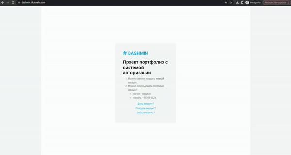

# Описание портфолио проекта dashmin.lokalwebs.com реализованного на Bitrix Framework
1. Проект представляет собой систему доступа к статистике Dashmin для зарегистрированных пользователей.
2. Проект реализован с помощью Bitrix Framework на основе **готовой верстке**.
3. Проект доступен по адресу https://dashmin.lokalwebs.com.

## Описание разделов проекта
Проект состоит из 5 разделов:
1. Главная страница.
2. Вход для зарегистрированных пользователей.
3. Создание аккаунта.
4. Восстановление пароля.
5. Доступ к статистике для зарегистрированных пользователей.

## Техническое описание - Bitrix
Применены:
1. Простые компоненты - статистическая информация.
2. Регистрация пользователя.
3. Авторизация пользователя.
4. Восстановление пароля.
5. Хранение статистической информации в инфоблоках.
6. Получение данных из инфоблока и запись их в Local Storage в браузере.
7. Чтение данных из Local Storage для JS-чартов.

## Оригинальная верстка
- Оригинальная верстка https://themewagon.github.io/dashmin/

## Техническое описание - Общее
- Хостинг - gohost.kz
- Версия PHP - 8.1.25
- База данных - MariaDB
- Редакция продукта Bitrix - Стандарт
- Главный модуль - 23.300.100
- Веб сервер - Nginx
- 
## Демо проекта

  

